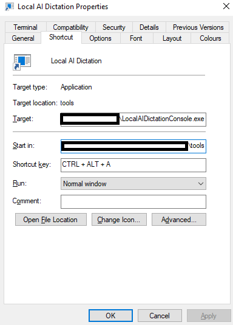

# Local AI Dictation (and pass to local LLM)

This project is designed to process voice using the Whisper AI model from OpenAI and then process LLM requests using the AnythingLLM API.

## Description

This project is a combination of powerful AI models and abstractions. First, we use the Whisper AI model from OpenAI to process voice data. Whisper is an automatic speech recognition (ASR) system that has been trained on a large amount of multilingual and multitask supervised data collected from the web.

After the voice data has been processed, we then use the AnythingLLM API to process LLM requests. AnythingLLM is a powerful model interface that is capable of handling a wide range of tasks.

## Environment Variables

The application uses the following **optional** environment variables:

- `WHISPER_SERVER_IP`: The IP address of the Whisper server. Defaults to "localhost".
- `WHISPER_AI_INITIAL_PROMPT_PATH`: Path to the file containing the initial prompt for the Whisper AI.
- `WHISPER_AI_POST_PROCESSING_PATH`: Path to the file containing post-processing instructions for the Whisper AI.
- `ANYTHING_LLM_API_KEY`: The API key for accessing the AnythingLLM API.
- `ANYTHING_LLM_DICTATION_WORKSPACE_NAME`: The name of the workspace for dictation in the AnythingLLM API.
- `AI_PROMPT_DICTATION`: Path to the file containing the dictation prompt for the AI.

## Getting Started

### Dependencies

This is designed to run in WSL for Windows on a PC with NVIDIA GPU *(confirmed working on a 6GB NVIDIA GPU)*.

Install NVIDIA CUDA software and WSL driver:

* <https://developer.nvidia.com/cuda-downloads>
* <https://developer.nvidia.com/cuda/wsl>

### Running Whisper Locally in Docker

To run Whisper locally in Docker, use the following command:

`docker run --detach --restart unless-stopped --gpus all -p 9000:9000 -e ASR_MODEL=small.en -e ASR_ENGINE=openai_whisper onerahmet/openai-whisper-asr-webservice:v1.6.0-gpu`

### Running AnythingLLM Locally in Docker

To run AnythingLLM locally in Docker, use the following commands:

`export STORAGE_LOCATION=$HOME/anythingllm && mkdir -p $STORAGE_LOCATION && touch "$STORAGE_LOCATION/.env" && docker run -d -p 3001:3001 --cap-add SYS_ADMIN -v ${STORAGE_LOCATION}:/app/server/storage -v ${STORAGE_LOCATION}/.env:/app/server/.env -e STORAGE_DIR="/app/server/storage" --restart=always mintplexlabs/anythingllm:1.2.3`

### Executing the Program

Ensure Whisper and AnythingLLM are running. Run the program and follow the prompts.

dotnet run --project LocalAIDictationConsole

## Notes

- Make sure to set the environment variables before running the application.
- Ensure Docker is installed and running on your system.
- The application assumes that the Whisper server and AnythingLLM API are accessible at the specified IP addresses and ports.

## Add a shortcut to your desktop

You can run the program with a shortcut anywhere in windows if you add a shortcut to the .exe as the target (and containing the path to the .exe in the "Start in" field).

For example I use Ctrl+Alt+A to run the program. The shortcut tab would look like this:

